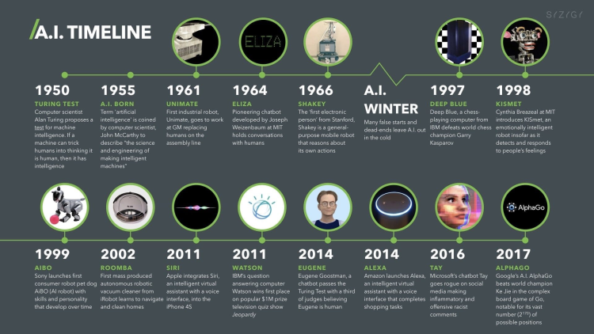
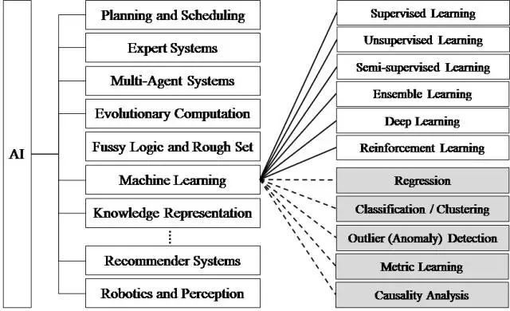
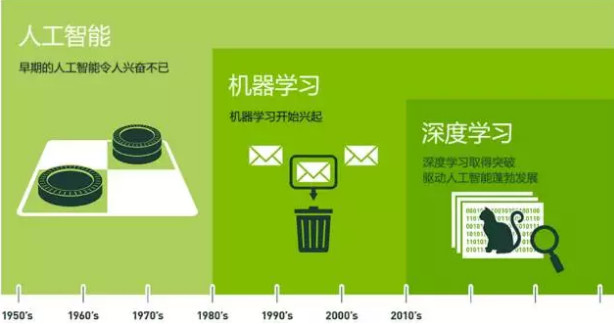
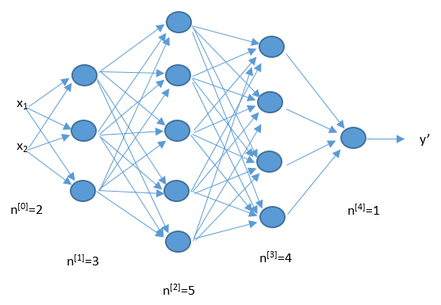

### 人工智能发展史

### 人工智能研究领域

### 机器学习与深度学习

### 深度学习

训练深度神经网络的过程就叫做深度学习。网络构建好了后，我们只需要负责不停地将训练数据输入到神经网络中，它内部就会自己不停地发生变化不停地学习。打比方说我们想要训练一个深度神经网络来识别猫。我们只需要不停地将猫的图片输入到神经网络中去。训练成功后，我们任意拿来一张新的图片，它都能判断出里面是否有猫。但我们并不知道他的分析过程是怎样的，它是如何判断里面是否有猫的。

