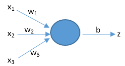
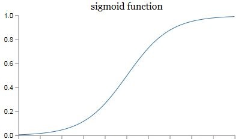

以逻辑回归为例，预测的过程其实只是基于一个简单的公式：z = dot(w,x) + b，公式中的x代表着输入特征向量，假设只有3个特征，那么x就可以用（x1，x2，x3）来表示。如下图所示。w表示权重，它对应于每个输入特征，代表了每个特征的重要程度。b表示阈值，用来影响预测结果。z就是预测结果。公式中的dot()函数表示将w和x进行向量相乘。

### 激活函数
以 sigmoid 函数为例，它的作用是把 z 映射到[0,1]之间。这样不仅便于神经网络进行计算，也便于我们人类进行理解。

$\sigma(z)=\frac{1}{1+e^{-z}}$

### 损失函数
在学习过程中，需要判断预测结果是否准确，以对自身进行调整，让预测结果越来越准确，这就要用到损失函数，损失函数是用来表现预测与实际数据之间的差距程度。实践中常用的损失函数为：

$L\left(\hat{y}^{(i)}, y^{(i)}\right)=-\left(y^{(i)} \log \left(\hat{y}^{(i)}\right)+\left(1-y^{(i)}\right) \log \left(1-\hat{y}^{(i)}\right)\right)$

上面是对单个样本定义损失函数，下面的公式用来用来衡量预测算法对整个训练集的预测精度，其实就是对每个样本的损失进行叠加，然后求平均值。我们称之为成本函数，它的计算结果越大，说明成本越大，预测结果越不准确。

$J(w, b)=\frac{1}{m} \sum_{i=1}^{m} L\left(\hat{y}^{(i)}, y^{(i)}\right)=-\frac{1}{m} \sum_{i=1}^{m}\left[\left(y^{(i)} \log \left(\hat{y}^{(i)}\right)+\left(1-y^{(i)}\right) \log \left(1-\hat{y}^{(i)}\right)\right]\right.$
