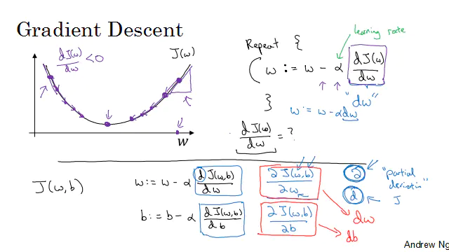

### 原理

$$
\begin{aligned}
&\text { Recap: } \hat{y}=\sigma\left(w^{T} x+b\right), \sigma(z)=\frac{1}{1+e^{-z}} \\
&J(w, b)=\frac{1}{m} \sum_{i=1}^{m} \mathcal{L}\left(\hat{y}^{(i)}, y^{(i)}\right)=-\frac{1}{m} \sum_{i=1}^{m} y^{(i)} \log \hat{y}^{(i)}+\left(1-y^{(i)}\right) \log \left(1-\hat{y}^{(i)}\right)
\end{aligned}
$$

结合上面公式和图，其实成本函数是一个关于 w 和 b 的函数，神经网络学习的目的就是找到一个合适的 w 和 b，使得 J(w, b) 最小，可以通过梯度下降算法来实现。

梯度下降算法的原理就是不断修改 w，不断逼近 J(w, b) 的最低点。可以通过下面公式来修改 w 值：

$$w^{\prime}=w-r^{\star} d w$$

其中 r 是学习率，dw 是 w 关于损失函数 J(w, b) 的偏导函数，就是上图的: $\frac{d J(\omega, b)}{d \omega}$

### 向量化

向量化的计算比用 for 循环性能高出很多，所以人工智能计算中，尽量使用矩阵计算。下面以逻辑回归为例：

**非向量化版本：**

$\begin{aligned}
&\text { for } \mathrm{i}=1 \text { to } \mathrm{m} \text { : } \\
&\text \quad { temp }=0 \\
&\text \quad { for } \mathrm{j}=1 \text { to } \mathrm{n}: \\
&\text \qquad { temp }+=w_{\mathrm{j}} \text { * } x_{\mathrm{j}}^{(\mathrm{i})} \\
&\mathrm \quad {z}^{(\mathrm{i})}=\mathrm{temp}+\mathrm{b} \\
&\mathrm \quad {a}^{(\mathrm{i})}=\sigma\left(\mathrm{z}^{(\mathrm{i})}\right)=1 /\left(1+\mathrm{e}^{-\mathrm{z}^{(\mathrm{i})}}\right) \\
&\mathrm \quad {J}+=-\left(\mathrm{y}^{(\mathrm{i})} * \log \left(\mathrm{a}^{(\mathrm{i})}\right)+\left(1-\mathrm{y}^{(\mathrm{i})}\right) * \log \left(1-\mathrm{a}^{(\mathrm{i})}\right)\right) \\
&\mathrm \quad {dz}^{(\mathrm{i})}=\mathrm{a}^{(\mathrm{i})}-\mathrm{y}^{(\mathrm{i})} \\
&\text \quad { for } \mathrm{j}=1 \text { to } \mathrm{n}: \\
&\mathrm \qquad {dw}_{\mathrm{j}}+=\mathrm{x}_{\mathrm{j}}^{(\mathrm{i})} * \mathrm{dz}^{(\mathrm{i})} \\
&\mathrm \quad {db}+=\mathrm{dz}^{(\mathrm{i})} \\
&\mathrm{J}=\mathrm{J} / \mathrm{m}, \mathrm{db}=\mathrm{db} / \mathrm{m}, \\
&\text { for } \mathrm{j}=1 \mathrm{to} \mathrm{n}: \\
&\mathrm \quad {dw}_{\mathrm{j}}=\mathrm{dw}_{\mathrm{j}} / \mathrm{m}
\end{aligned}$

**向量化的版本：**

$\begin{aligned}
&Z=n p \cdot d o t(w \cdot t, X)+b \\
&A=\sigma(Z)=1 /(1+n p \cdot \exp (-Z)) \\
&J=n p \cdot \operatorname{sum}\left(-\left(Y^{*} n p \cdot \log (A)+(1-Y)^{*} n p \cdot \log (1-A)\right)\right) / m \\
&d Z=A-Y \\
&d w=n p \cdot d o t(X, d Z \cdot t) / m \\
&d b=n p \cdot \operatorname{sum}(d Z) / m
\end{aligned}$

### 代码实现